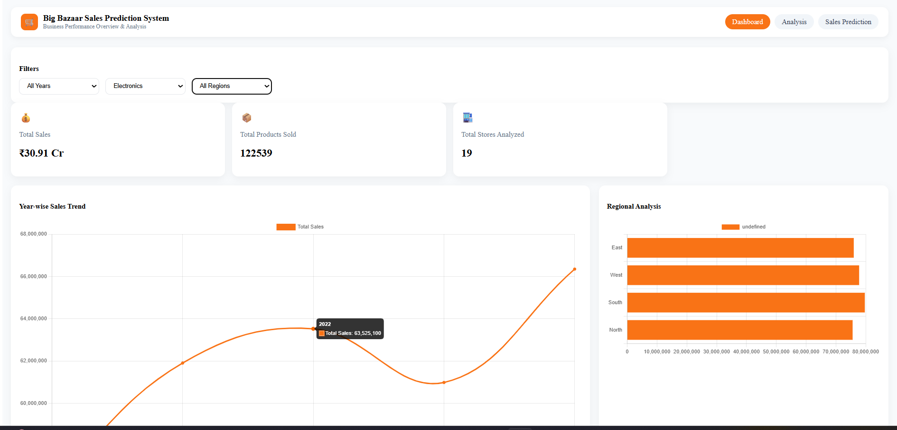
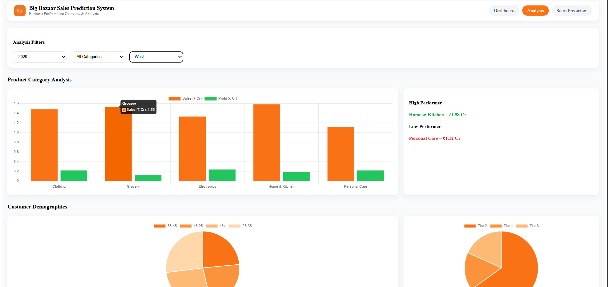
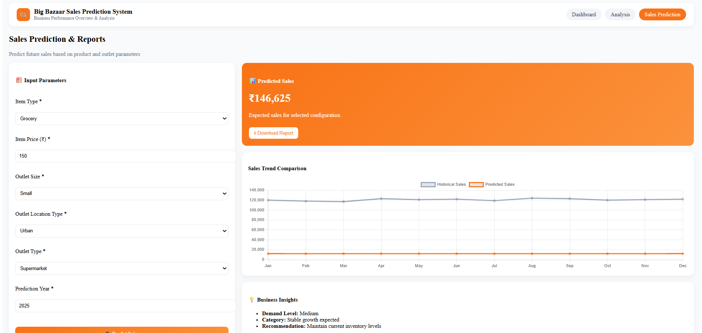

# 🛒 Big Bazaar Sales Prediction System

A Machine Learning based web application designed to analyze historical retail sales data and predict future sales for Big Bazaar. The system provides interactive dashboards, deep sales analysis, and a sales prediction module with downloadable reports.

## 📌 Project Details
Domain: Machine Learning  
Developed By: Sajiya Shaikh  

## 🎯 Project Objective
- Analyze Big Bazaar sales data
- Identify trends and patterns
- Predict future sales using ML concepts
- Provide business insights through dashboards
- Generate downloadable sales prediction reports

## 🧠 Machine Learning Approach
- Data preprocessing and feature selection
- Regression-based prediction logic
- Prediction factors:
  Item Price, Item Category, Outlet Size, Outlet Location Type, Year
- Output: Predicted Sales Value

## 📊 Key Features
- Interactive Dashboard (KPIs & Trends)
- Sales Analysis (Category & Region)
- Sales Prediction Module
- Downloadable Excel Reports
- Business Insights & Recommendations

## 🛠 Technology Stack
Frontend: React.js, Chart.js, Axios  
Backend: Node.js, Express.js  
Tools: XLSX, Git, GitHub  

How to run (comments only):
Go to backend folder  
Run npm install  
Run node server.js  
Go to frontend folder  
Run npm install  
Run npm start  

## 📸 Screenshots

  
  
  

Developed by Sajiya Shaikh